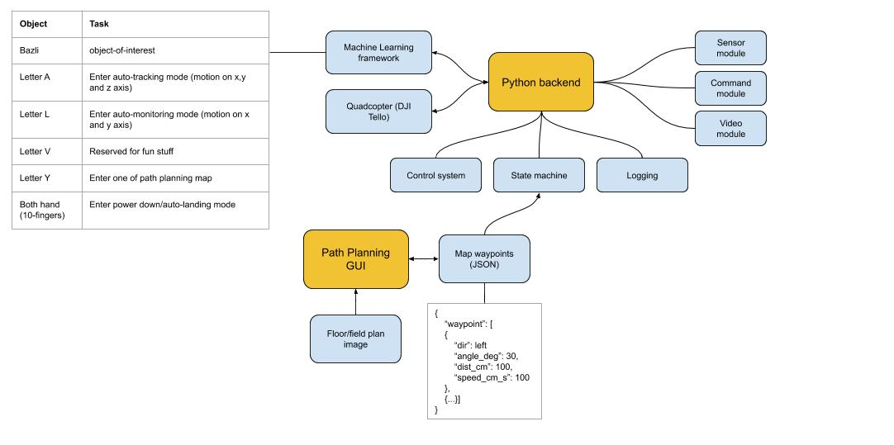

# PROJECT TELLO AI

#### Background
This is Tello AI project from RobotAndCode youtube channel. It contains
basic SDK implementation based on Ryze documentation at [Tello SDK Document](https://dl-cdn.ryzerobotics.com/downloads/Tello/Tello%20SDK%202.0%20User%20Guide.pdf).

#### System Overview


#### Code Structure
```
.
├── README.md
├── component-diagram.jpg   <-- Big picture component diagram
├── image.png               <-- Map being used for Path Planning GUI
├── path-plan.py            <-- Path Planning GUI program
├── tello-command.py        <-- Basic Tello's SDK command
├── tello-state.py          <-- Basic Tello's SDK sensor state
└── tello-stream.py         <-- Basic Tello's SDK video stream
```

#### Youtube Channel
Checkout my youtube channel [RobotAndCode](https://www.youtube.com/channel/UCQam-u9KZaMSelXoJDRrYJA?view_as=subscriber) for more exciting robot and code projects.